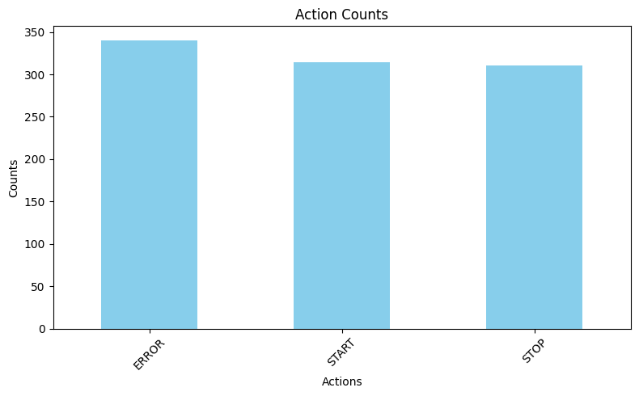
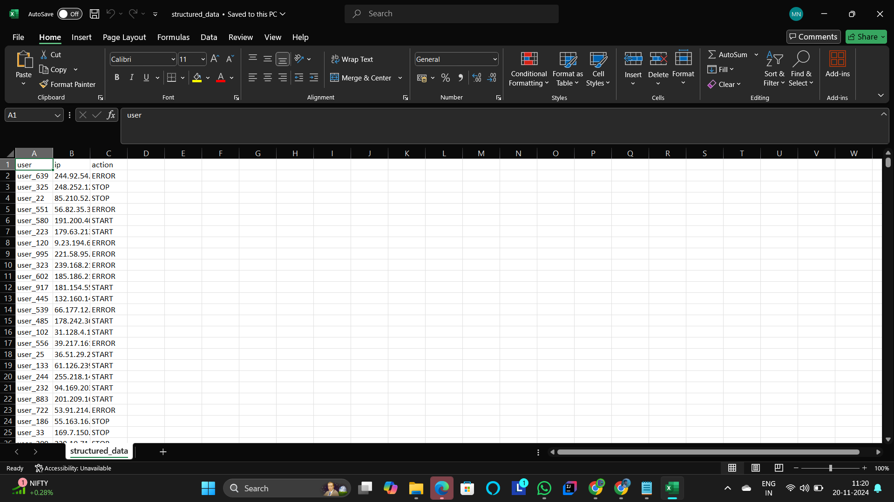
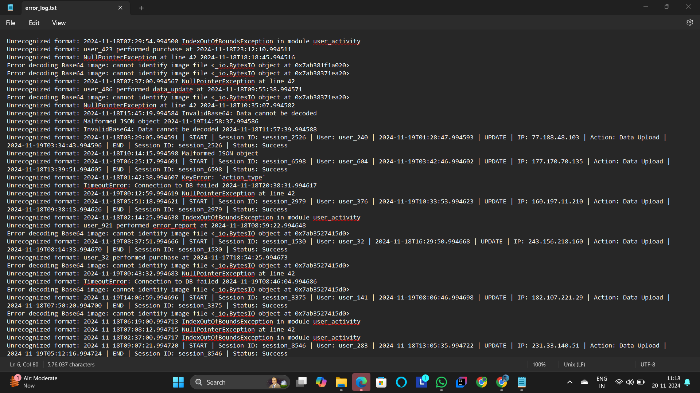

# IoT Log Parser

This project is a robust IoT log parser developed to extract, structure, and visualize data from diverse IoT logs. It handles various formats, including key-value pairs, Base64 encoded images, and JSON data, while also managing errors gracefully.

## Features
1. Data Extraction and Structuring
Key-Value Pair Parsing: Extracts and organizes key-value pairs into a structured format.
Base64 Image Decoding: Decodes Base64 images and optionally saves them.
JSON Parsing: Processes JSON-formatted log entries and integrates them into the structured data.
Structured Output: Converts parsed data into a Pandas DataFrame for analysis and saves it as a CSV file.
2. Error Handling
Robustly skips and logs errors without crashing.
Outputs detailed error messages for debugging, saved in error_log.txt.
3. Visualization
Generates bar charts for action counts if the "action" column is present in the data.

## Installation and Setup
1.Clone the repository:
git clone https://github.com/nithin849/IoT-Log-Parser.git
cd IoT-Log-Parser

2.Install dependencies:
pip install pandas matplotlib pillow

## How to Run
1.Open the script in Google Colab or any Python environment that supports interactive file uploads.
2.Run the script, and you will be prompted to upload your log file.
3.After parsing, download the outputs:
  -->structured_data.csv: Contains the structured data.
  -->error_log.txt: Logs errors encountered during parsing.

## Output Files
- `structured_data.csv`: Parsed data.
- `error_log.txt`: Errors encountered during parsing.
- `visualization.png`: Data visualization.

## Assumptions
1.Log files may contain mixed formats (Base64, key-value pairs, JSON).
2.Base64 strings are prefixed with "BASE64:".
3.JSON entries are enclosed in {}.
4.Key-value pairs follow the key=value format.

## Screenshots

## Performance Analysis
1.Processing Speed: Efficiently processes small to medium-sized log files in under a second per 1000 lines.
2.Visualization Speed: Generates charts instantly for up to 10,000 actions.
